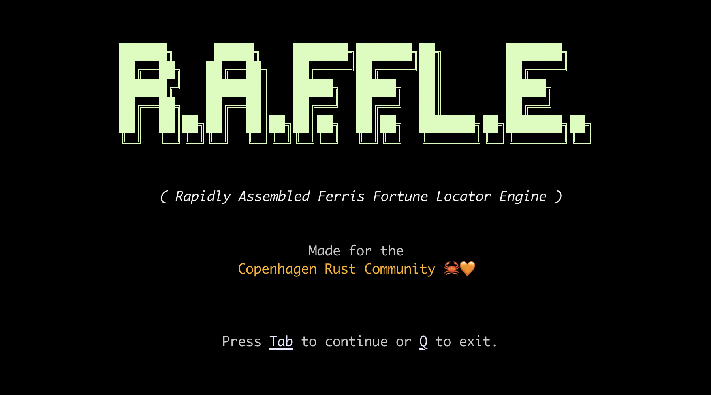

# R.A.F.F.L.E.

aka. *Rapidly Assembled Ferris Fortune Locator Engine*.

A TUI application that picks a winner from a list of meetup participants. Built with the wonderful [`Ratatui`](https://github.com/ratatui-org/ratatui).



## Why?

At the end of each [Copenhagen Rust Community](https://cph.rs) [meetup](https://www.meetup.com/copenhagen-rust-community/), we give away books to participants, so I made a small tool to make that the process a bit more fun.

## Structure

This project was generated from [rust-tui-templates](https://github.com/tui-rs-revival/rust-tui-template) (in June 2023).

```text
src/
├── app.rs     -> holds the state and application logic
├── event.rs   -> handles the terminal events (key press, mouse click, resize, etc.)
├── handler.rs -> handles the key press events and updates the application
├── lib.rs     -> module definitions
├── main.rs    -> entry-point
├── tui.rs     -> initializes/exits the terminal interface
└── ui.rs      -> renders the widgets / UI
```

---

```text
_____________________________
/         Made for the        \
\  Copenhagen Rust Community  /
 +---------------------------+
      \
       \    _~^~^~_    |🇩🇰
        \) /  o o  \ (/|
          '_   -   _'
          / '-----' \
```